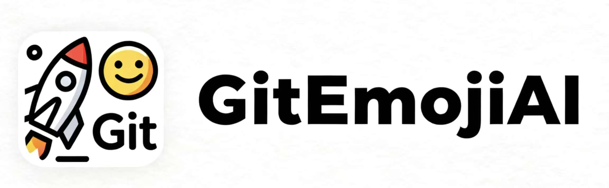

<div align="center">
  <picture>
    
  </picture>
</div>

<hr>

<div align="center" style="line-height: 1;">

[](https://github.com/TinkerGeeker/GitEmojiAI/blob/main/assets/wechat.jpg)
[](https://github.com/TinkerGeeker/GitEmojiAI)
[](https://github.com/TinkerGeeker/GitEmojiAI/blob/main/assets/xiaohongshu.jpg)

</div>

# GitEmojiAI

🤖 专为 AI 设计的 Git 提交规范工具包

通过标准化的提示词和多种提交规范，帮助 AI 生成规范、美观的 Git 提交信息，提升代码协作质量。

### 核心文件
 
- [`prompt.md`](prompt.md) - AI 提示词，定义助手角色和任务，指导 AI 生成规范提交信息
- [`commit_emoji.md`](commit_emoji.md) - Gitmoji 提交规范，提供表情符号和提交格式指南
- [`commit_angular.md`](commit_angular.md) - Angular 提交规范，适用于严格标准化项目
- [`commit_conventional.md`](commit_conventional.md) - Conventional Commits 规范，提供语义化提交标准
- [`commit_google.md`](commit_google.md) - Google Git 提交规范，提供 Google 内部最佳实践
- [`commit_community.md`](commit_community.md) - 社区扩展与最佳实践，补充通用提交规范

## 怎么做
 
**基本用法**：

```bash
请阅读@/projects/GitEmojiAI/prompt.md 并结合[规范类型]规范，使用[语言配置]，对[仓库]的变更进行[附加操作]
  │
  ├─⫸ [规范类型]：可选值（默认：Gitmoji）
  │     Gitmoji|Angular|Conventional Commits|Google|社区扩展
  │
  ├─⫸ [语言配置]：可选值（默认：系统语言）
  │     英文|中文
  │
  └─⫸ [附加操作]：可选值（默认：仅提交）
        并推送
```

```bash
# 让 AI 读取默认规范（Gitmoji）并执行提交
请阅读@/projects/GitEmojiAI/prompt.md 使用中文，对当前项目的变更进行提交并推送
```
 
**指定规范版本**：
```bash
# Gitmoji 规范（默认）
请阅读@/projects/GitEmojiAI/prompt.md 并使用 Gitmoji 规范对当前项目的变更进行提交
 
# Angular 规范
请阅读@/projects/GitEmojiAI/prompt.md 并使用 Angular 规范对当前项目的变更进行提交
 
# Conventional Commits 规范
请阅读@/projects/GitEmojiAI/prompt.md 并使用 Conventional Commits 规范对当前项目的变更进行提交
 
# Google 规范
请阅读@/projects/GitEmojiAI/prompt.md 并使用 Google 规范对当前项目的变更进行提交
 
# 社区扩展规范
请阅读@/projects/GitEmojiAI/prompt.md 并使用社区扩展规范对当前项目的变更进行提交
```

**语言配置**：
```bash
# 指定英文提交信息
请阅读@/projects/GitEmojiAI/prompt.md 并使用英文对当前项目的变更进行提交

# 指定中文提交信息
请阅读@/projects/GitEmojiAI/prompt.md 并使用中文对当前项目的变更进行提交，并推送
```
 
**工作流程**：
1. AI 读取提示词 (`prompt.md`) 和指定的规范文件
2. 检查 Git 仓库状态和代码变更
3. 暂存相关文件
4. 根据规范生成提交信息
5. 执行 Git 提交和推送操作

## 示例
 
### 初始化项目
```bash
# 用户输入
请阅读@/projects/GitEmojiAI/prompt.md 对@/projects/GitEmojiAI 进行提交和推送操作
 
# AI 执行过程
1. AI 读取提示词和默认规范文件（commit_emoji.md）
2. 检查 Git 仓库状态
3. 暂存所有文件
4. 生成提交信息: :tada: 初始化 GitEmojiAI 项目
5. 执行 Git 提交和推送操作
```
 
## Gitmoji 分类示例
 
### 🚀 功能开发类
- ✨ `:sparkles:` - 引入新功能、新特性
- 🆕 `:new:` - 引入全新功能或文件
- 🎨 `:art:` - 改进代码结构/格式
 
**示例**：
```bash
git commit -m ":sparkles: 添加用户认证功能"
git commit -m ":new: 引入新的 API 接口"
git commit -m ":art: 优化代码结构和格式"
```
 
### 🐛 问题修复类
- 🐛 `:bug:` - 修复 Bug
- 🚑 `:ambulance:` - 紧急 Bug 修复
- 🔒 `:lock:` - 修复安全漏洞
 
**示例**：
```bash
git commit -m ":bug: 修复登录错误处理"
git commit -m ":ambulance: 紧急安全补丁"
git commit -m ":lock: 修复安全漏洞"
```
 
### 📝 文档与配置类
- 📝 `:memo:` - 文档更新或撰写
- 🔧 `:wrench:` - 配置文件修改
- 📚 `:books:` - 添加或更新文档
 
**示例**：
```bash
git commit -m ":memo: 更新 API 文档"
git commit -m ":wrench: 更新配置文件"
git commit -m ":books: 添加项目文档"
```
 
### ⚡ 性能与优化类
- ⚡ `:zap:` - 性能优化
- 🔄 `:recycle:` - 代码重构
- 🔥 `:fire:` - 移除代码或文件
 
**示例**：
```bash
git commit -m ":zap: 优化数据库查询性能"
git commit -m ":recycle: 重构用户服务模块"
git commit -m ":fire: 移除废弃代码"
```
 
### 📦 依赖管理类
- 📦 `:package:` - 添加新的依赖
- ⬆️ `:arrow_up:` - 升级依赖版本
- ⬇️ `:arrow_down:` - 降级依赖版本
 
**示例**：
```bash
git commit -m ":package: 添加 lodash 依赖"
git commit -m ":arrow_up: 升级 React 版本"
git commit -m ":arrow_down: 降级依赖版本"
```
 
### 🧪 测试与部署类
- 🧪 `:test_tube:` - 添加或更新测试
- 🚀 `:rocket:` - 部署或发布功能
- 🔖 `:bookmark:` - 发布版本标签
 
**示例**：
```bash
git commit -m ":test_tube: 添加单元测试"
git commit -m ":rocket: 部署到生产环境"
git commit -m ":bookmark: 发布 v1.0.0 版本"
```

## 参考

### 官方规范
- [Angular Commit Message Format](https://github.com/angular/angular/blob/main/contributing-docs/commit-message-guidelines.md) - Angular 官方提交规范
- [Conventional Commits](https://www.conventionalcommits.org/) - Conventional Commits 官方网站
- [Google Style Guide](https://google.github.io/styleguide/) - Google 风格指南

### 社区资源
- [git-commit-emoji-cn](https://github.com/liuchengxu/git-commit-emoji-cn) - Git 提交表情符号中文指南
- [gitmoji](https://github.com/carloscuesta/gitmoji) - Gitmoji 官方仓库
- [emoji-cheat-sheet](https://github.com/ikatyang/emoji-cheat-sheet) - Emoji 速查表

### 项目文件结构
```
projects/GitEmojiAI/
├── README.md                    # 项目说明文档，提供项目概览和使用指南
├── prompt.md                    # AI 提示词文件，指导 AI 生成规范提交信息
├── commit_emoji.md              # Gitmoji 提交规范，提供表情符号和提交格式指南
├── commit_angular.md            # Angular 提交规范，适用于严格标准化项目
├── commit_conventional.md       # Conventional Commits 规范，提供语义化提交标准
├── commit_google.md             # Google Git 提交规范，提供 Google 内部最佳实践
├── commit_community.md          # 社区扩展与最佳实践，补充通用提交规范
└── assets/                      # 项目资源文件目录
    ├── logo.jpg                 # 项目 Logo 图片
    ├── wechat.jpg               # 微信公众号二维码图片
    └── xiaohongshu.jpg          # 小红书二维码图片
```

### 工具支持
- [commitlint](https://commitlint.js.org/) - 提交信息校验工具
- [husky](https://typicode.github.io/husky/) - Git Hooks 工具
- [semantic-release](https://github.com/semantic-release/semantic-release) - 自动化版本发布
- [standard-version](https://github.com/conventional-changelog/standard-version) - 版本管理工具

## 贡献

欢迎提交 Issue 和 Pull Request 来改进这个项目。

## 许可证

MIT License